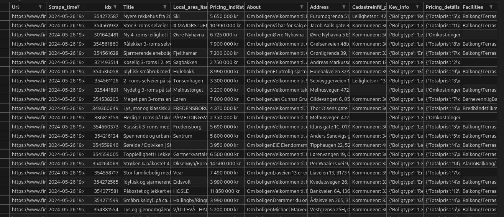
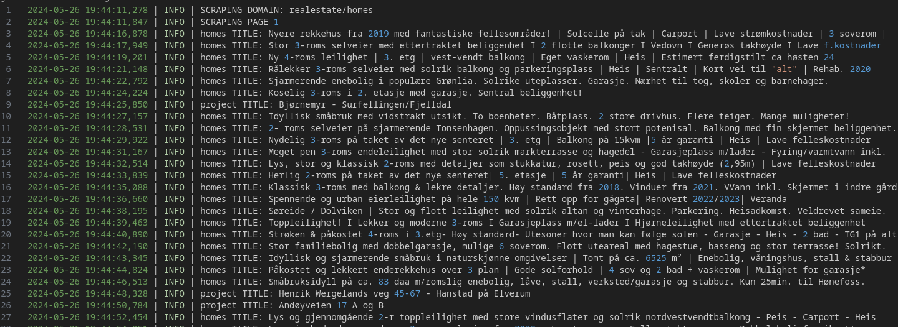
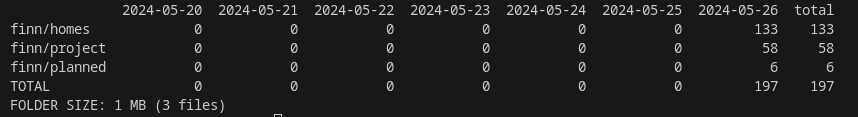

# About
Scraping Finn with Python and requests. **Work in progress**.

CSV example

Log example

Report

# Setup
`mkdir finn`\
`mkdir logs`\
`pip install -r requirements.txt`

### To run
`python src/finn_scraper.py`

## Checklist
- [ ] Add detail to headers.
- [ ] Add sleep timer and folder etc to parameters.yml.
- [ ] Custom queries instead of binary daily/not daily scrape.